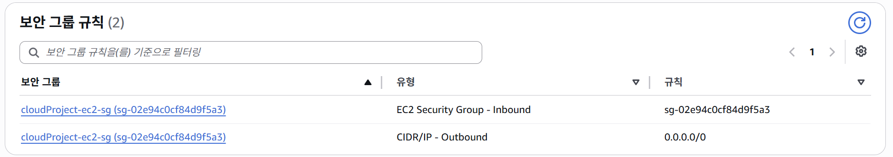
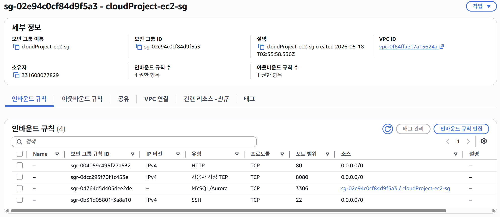
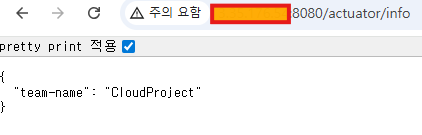

## 🛠️ Cloud Project

> ### 👨‍🏫 프로젝트 소개

#### Spring Boot 애플리케이션을 AWS에 배포하며 클라우드 기반 백엔드 구조를 학습한 프로젝트입니다.

#### EC2, RDS, S3, Parameter Store를 활용해 운영 환경에서 필요한 인프라 구성과 배포 흐름을 경험했습니다.

---

> ### 📌 주요 개선 사항 (과제 제출 요구사항 포함)

LV0. 요금 폭탄 방지 AWS Budget 설정

- 월별 예산 100달러 설정
- 예산의 80% 초과할 경우 이메일 알림 발생 설정

LV1. 네트워크 구축 및 핵심 기능 배포

- 인프라 구축(VPC & EC2)
  - VPC 설정 후 Public/Private Subnet 분리
  - Public Subnet에 EC2 생성

- 애플리케이션 개발 (팀원 정보 저장 및 조회 API)
  - 팀원 이름, 나이, MBTI를 JSON으로 받아 저장하는 API `POST` `/api/members`
  - 저장된 팀원 정보 조회 API `GET` `/api/members/{id}`
  - Profile 분리 (local: H2, prod: MySQL)
  - 로그 전략 (API 요청마다 `INFO`레벨로 로그 기록, 에러 발생 시 `ERROR`레벨)

LV2. DB 분리 및 보안 연결

- 인프라 구축
  - RDS: Public Subnet에 MySQL 생성
    
    
  - 보안 그룹 체이닝: STEP1에서 생성한 EC2 보안 그룹ID만 허용
  - Parameter Store: DB 접속 정보(url, username, password)와 확인용 파라미터 저장
  

---

> ### ⏲️ 개발기간

- 2026.05.18 ~ 2026.05.25

---

> ### 📚️ 기술스택

| 구분 | 사용 기술 |
|---|---|
| Language | Java 17 |
| Backend | Spring Boot, Spring Web |
| Data Access | Spring Data JPA |
| Database | MySQL |
| Validation | Spring Boot Validation |
| Test | JUnit 5, Mockito |
| Build / Tool | Gradle, Lombok |
| IDE | IntelliJ IDEA |
| Version Control | Git, GitHub |

---

> ### 🔥 Trouble Shooting

1. EC2 환경에서 RDS 연결 실패

#### 문제
- EC2에서 Spring Boot 애플리케이션을 `prod` profile로 실행하는 과정에서 JPA 초기화 오류 발생

#### 원인
- 처음에는 DB URL, Parameter Store 주입, RDS 보안 그룹 문제를 의심했지만,
- 확인 결과 `Parameter Store`에 저장한 `DB_USERNAME 값`과 `실제 RDS 마스터 사용자명`이 일치하지 않아 발생한 문제

#### 해결
- `Parameter Store`의 `DB_USERNAME` 값을 실제 RDS 사용자명 수정한 뒤,
  EC2에서 환경변수를 다시 주입하고 애플리케이션을 재실행

#### 느낀 점
- 단순한 설정 오류도 설정 파일, 환경변수, 네트워크, 인증 정보가 함께 얽혀 있어 원인을 바로 찾기 어렵다는 것을 경험

👉 자세한 정리

https://velog.io/@gpekd5/Cloud-%EA%B3%BC%EC%A0%9C-TroubleShooting-EC2-%EC%A0%91%EC%86%8D-%ED%9B%84-%EC%9A%B4%EC%98%81%ED%99%98%EA%B2%BD-%EC%8B%A4%ED%96%89-%EC%98%A4%EB%A5%98

---

> ### 📘 개념 학습

#### 1.

---

> ### ✅ 회고

